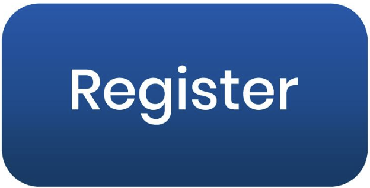
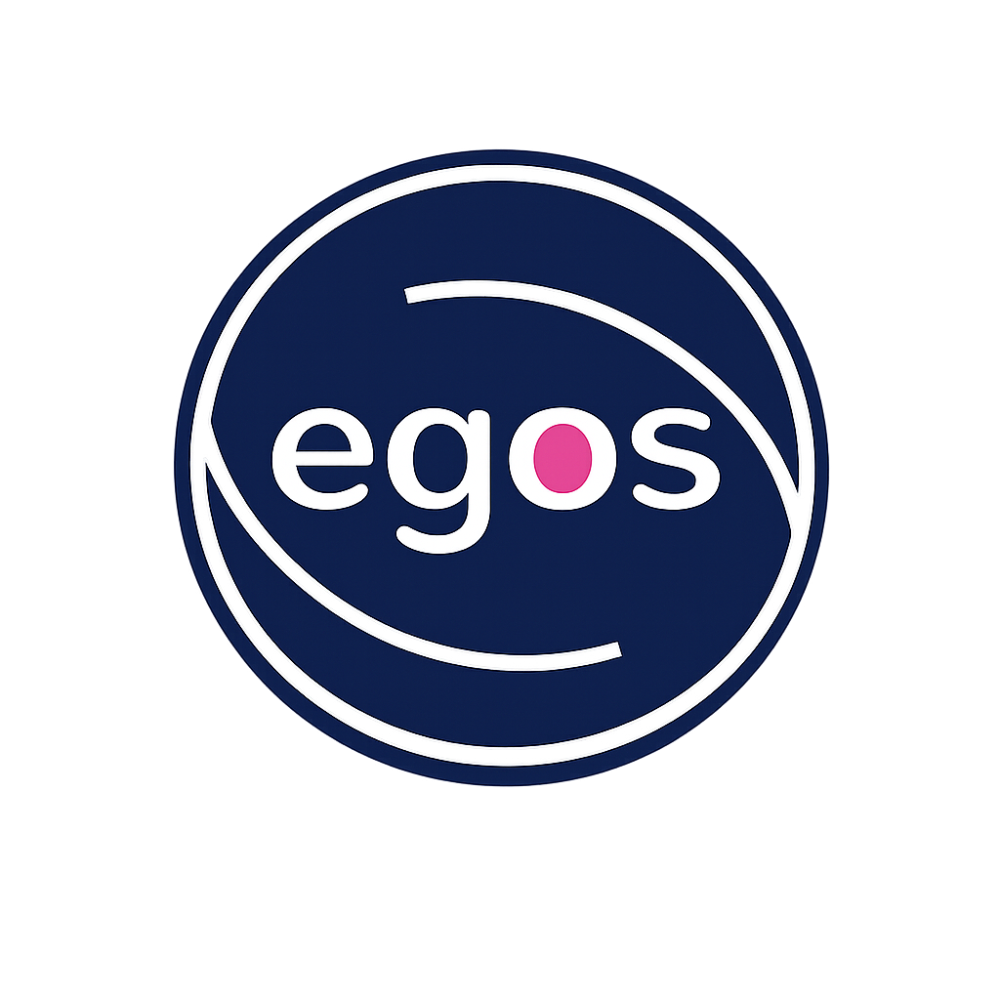

  
  
  
  

<h3 align="center">Register to Get the Latest Updates: <a href="https://forms.cloud.microsoft/r/s1XnFWi41B" target="_blank" rel="noopener noreferrer">
    Registration
  </a>
</h3>

<body>
    

        <!-- Register -->
        
        <!-- YouTube 
         -->
        <!-- SWGs -->
        
        <!-- LinkedIn -->
        
    

</body>

## Purpose
 
> The purpose of our Standing Working Group (SWG) is to equip our fields with the conceptual and methodological foundations for studying societal governance from an international and comparative perspective. Achieving this will require broadening our intellectual resources. 
>
> By societal governance, we mean the decision-making structures and processes that shape the direction of society as a whole. Systems of societal governance—the kinds of actors involved in setting this direction (government agencies, private sector businesses, community organizations, and others) and their relative roles—vary by country and sector. We are eager to learn about the strengths and weaknesses of these systems in the face of the polycrisis and the interacting grand challenges that form it. 
>
> We envision an international and multidisciplinary learning process that engages SWG members with (1) disciplines such as management and organization studies, public management, public policy, political science, and comparative social sciences; (2) perspectives from Asia, Europe, North America, as well as Africa and Latin America; and (3) social movements and organizations at the forefront of addressing the polycrisis.

<!--
## Get the Latest Updates
 
> If you would like to receive updates about our upcoming seminars, conferences and other activities, please fill out the registration form here: <a href="https://forms.cloud.microsoft/r/s1XnFWi41B" target="_blank" rel="noopener noreferrer">Registration</a>

-->

